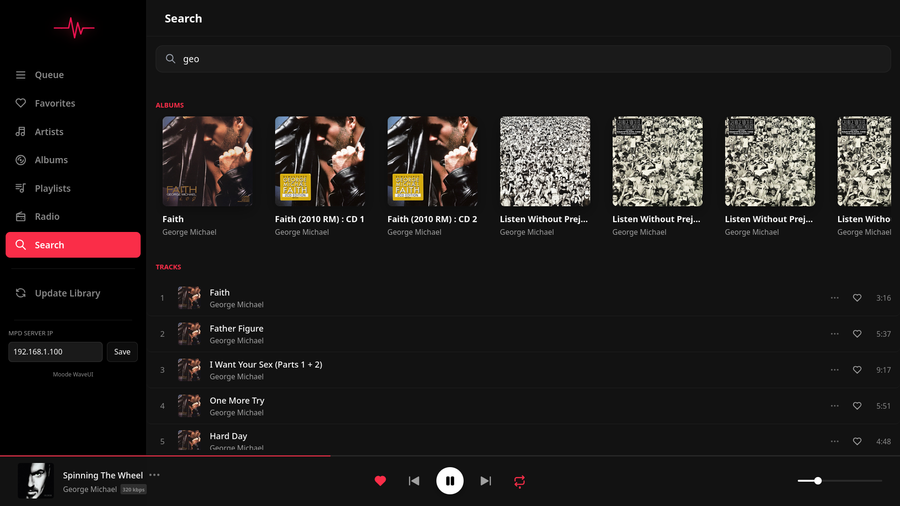
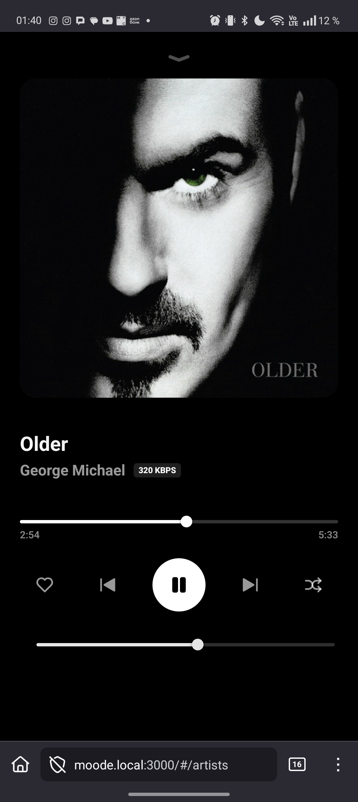
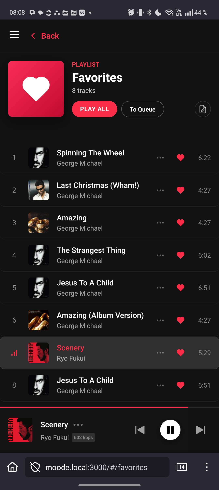

# Wave-UI for moOde Audio

A lightweight, high-performance web interface for **moOde Audio**, built to be fast, modern, and perfectly suited for mobile devices.

<p align="center">

  <br> <br>
 
</p>

## Key Features

1. **Svelte-Powered Frontend:** Built with **Svelte** for maximum speed. It feels lightning-fast compared to standard web interfaces because it compiles to highly efficient vanilla JavaScript.
2. **Modern Mobile Experience:** Designed from the ground up to be mobile-friendly. Responsive layouts, touch-optimized sliders, and intuitive gestures make it feel like a native app.
3. **Local Indexing (IndexedDB):** * No more waiting for the server to load lists.
* Metadata is stored in a local **IndexedDB** in your browser.
* Synchronization is handled by a background **Web Worker**, ensuring the UI never freezes while updating thousands of tracks.


4. **Native Integration:** * Communicates directly with **MPD** via WebSockets for real-time playback control.
* Hooks into native **moOde PHP methods** for library synchronization and system functions.


5. **Smart Caching:** Uses a **Service Worker** to cache album art locally, saving bandwidth and making the interface load instantly on repeated visits.

## Installation

The automated script handles cloning, setting up the systemd service for the WebSocket bridge, and configuring Nginx.

### One-click install on moOde server:

```bash
wget -qO- https://raw.githubusercontent.com/dmitrymake/wave-ui/main/install.sh | bash

```

**Network Access:**
The UI is served on **port 3000** (e.g., `http://moode.local:3000`).
*Note: We use port 3000 instead of a dedicated `.local` name because mDNS typically only supports one primary hostname per IP. Using a specific port is the most reliable way to avoid conflicts with the main moOde interface.*

## Direct MPD Control

Wave-UI uses `websockify` to bridge the MPD protocol over WebSockets. This allows for near-zero latency when skipping tracks or adjusting volume, providing instant feedback.

---

### Support the Project

If you find this UI helpful and want to support the development, feel free to buy me a coffee!

* **USDT (ERC-20):** `0x06b4561be399F66dBDB1Fba885639B12D984239E`
* **USDT (BEP-20):** `0x06b4561be399F66dBDB1Fba885639B12D984239E`

---
